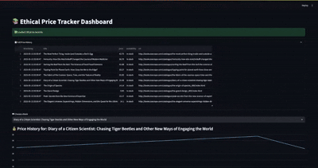

# Ethical Price Tracker

This project tracks book prices over time from [BooksToScrape](http://books.toscrape.com/) — a public sandbox site built for scraping practice.  
It ethically collects product data using Python, Selenium, and BeautifulSoup, stores it in SQLite, and visualizes trends with Streamlit.

---

## ✅ Features

- 🔍 Scrapes book prices, availability, and product links
- 🧠 Simulates real-world price changes for testing trends
- 💾 Stores timestamped data in CSV and SQLite
- 📊 Visualizes price history per book using Streamlit
- ✅ Clean, ethical, and modular code structure

---

## ✅ Problem Statement

How can we ethically track product prices over time to analyze pricing trends and notify users of drops — while respecting website usage policies and ensuring clean, scalable data handling?

## 📊 Live Demo (GIF)

---

## Demo Video

https://drive.google.com/file/d/1HYsJuHhGVwQ2HKXE8Ucb4XSkH5V_fgg2/view?usp=sharing

---

## ✅ Step-by-Step Project Structure

## 📁 Folder Layout
ethical_price_tracker/
│
├── data/
│ ├── raw/ # Contains book_prices.csv
│ └── book_prices.db # SQLite database
│
├── scripts/
│ ├── scrape.py # Scrapes prices using Selenium + BeautifulSoup
│ ├── store.py # Saves CSV data into SQLite
│
├── dashboard/
│ └── app.py # Streamlit dashboard to view price trends
│
├── requirements.txt
└── README.md

